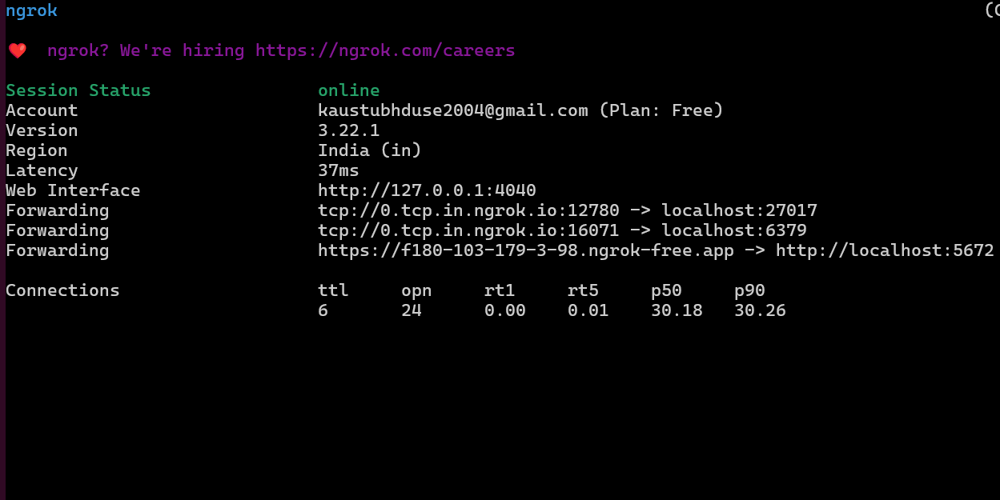

# Sports Application Microservices

## Overview

This project is a scalable, cloud-native sports application built using a microservices architecture. It manages various aspects such as user authentication, event management, live auctions, real-time scores, and payment processing. The system emphasizes modularity, containerization, and automated deployment.

---

## Architecture

The application comprises **6 independent microservices**:

- **auth-service**: Manages user authentication, JWT token issuance, refresh tokens, and integrates Google OAuth 2.0.
- **user-service**: Handles user profiles, including bio and avatar updates.
- **event-service**: Facilitates event creation, registration, and scheduling.
- **auction-service**: Conducts live player/team auctions using Socket.IO.
- **live-score-service**: Provides real-time match scores and updates.
- **payment-service**: Processes payments via Stripe.
- **rag-agent-service**: Provides Q&A related to all the data stored in databases using RAG

---

## Technologies Used

- **Containerization**: Docker  
- **Orchestration & Deployment**: AWS Elastic Kubernetes Service (EKS)  
- **CI/CD**: Jenkins, ArgoCD  
- **Monitoring & Observability**: Prometheus, Grafana  
- **Databases**:
  - PostgreSQL (for auth-service and user-service)
  - MongoDB (for event-service, auction-service, live-score-service, and payment-service)
- **Communication**:
  - RabbitMQ (Publisher: event-service, Consumer: auction-service)
  - REST APIs (for inter-service communication)
  - Socket.IO (for real-time features in auction and live-score services)
- **Caching**: Redis
  - `auction-service`: Stores ongoing auction data
  - `live-score-service`: Stores live match data
  - `payment-service`: Stores failed transaction information
- **Langchain**: for orchestrating retrieval + generation pipelines
- **OpenAI API**: for LLM-based text generation
- **Pinecone**: for vector similarity search

---

## Workflow

### Auth Service
- Handles user registration and login processes.
- Issues JWT tokens and refresh tokens.
- Integrates Google OAuth 2.0 for authentication.
- Stores refresh tokens in the `postgres_auth` database.

### User Service
- Receives user ID, name, and email upon registration via inter-service communication.
- Stores user data in the `postgres_user` database.
- Allows users to update their bio and avatar.

### Event Service
- Enables admins to create events.
- Allows users to register as players or owners.
- Retrieves user information via user-service API calls.
- Publishes registration information to RabbitMQ.

### Auction Service
- Consumes participant data from RabbitMQ.
- Fetches event information from the event-service.
- Conducts live auctions using Socket.IO.
- Uses Lua script for solving problem of coccurrent bids
- Stores ongoing auction data in Redis for quick access.

### Live Score Service
- Receives player and team data post-auction.
- Provides live score updates using Socket.IO.
- Temporarily stores match data in Redis.

### Payment Service
- Integrates Stripe for card payments.
- Stores failed transactions in Redis for retry mechanisms.

### RAG Agent Service
- Uses LangChain to process user queries, retrieve data, and generate contextual responses.
- Connects to PostgreSQL(auth & user data), MongoDB (event, auction, score, and payment data), Pinecone (semantic vector search), OpenAI and Hugging Face models for text generation

---

## Deployment

- Each microservice is containerized using Docker and connected to its respective database.
- All six microservices are deployed with **2 replicas (pods)** each on AWS EKS.


---

### AWS EC2 Setup

Four EC2 instances are configured as follows:

1. **Jenkins Master**: Hosts the primary Jenkins server.
2. **Jenkins Agent**: Executes CI pipeline jobs.
3. **EKS Bootstrap Server**: Sets up `eksctl` and initializes the Kubernetes cluster.
4. **Monitoring Server**: Runs Prometheus and Grafana for monitoring purposes.

- Kubernetes manifests for all services are defined in the `argocd` directory.
- Each microservice is exposed via an External IP.


---

### ArgoCD Configuration

- ArgoCD is installed on the EKS cluster.
- Configured to monitor and deploy services based on changes in the Git repository.


---

### CI/CD Pipeline (Jenkins)

- A webhook triggers the pipeline upon code pushes to GitHub.
- Pipeline stages include:
  1. Installing dependencies.
  2. Building and pushing Docker images to DockerHub.
  3. Updating deployment manifests with the latest image tags.
  4. ArgoCD automatically deploys updated manifests to EKS.


---

### Tunneling Services via Ngrok

- Ngrok is utilized to expose RabbitMQ, Redis, and MongoDB for testing purposes.


```bash
ngrok start --all --config ./ngrok.yml
```



---

### Monitoring

- Prometheus collects metrics from all services.
- Grafana dashboards visualize system performance and health.


---

## Getting Started

### Prerequisites

- Docker & Docker Compose
- AWS CLI & `eksctl`
- `kubectl` configured for your EKS cluster

---

### Running Locally

1. **Clone the repository:**

   ```bash
   git clone https://github.com/kaustubhduse/Sports-auction.git
   cd sports-application
   ```

2. **Create `.env` files** for each microservice with appropriate values:

   - **auth-service**:
     ```env
     PORT=""
     DATABASE_URL=""
     ACCESS_TOKEN_SECRET=""
     ACCESS_TOKEN_EXPIRY=""
     REFRESH_TOKEN_SECRET=""
     REFRESH_TOKEN_EXPIRY=""
     GOOGLE_CLIENT_ID=""
     GOOGLE_CLIENT_SECRET=""
     GOOGLE_CALLBACK_URL=""
     SESSION_SECRET=""
     ```

   - **user-service**:
     ```env
     PORT=""
     DATABASE_URL=""
     ACCESS_TOKEN_SECRET=""
     ```

   - **event-service**:
     ```env
     PORT=""
     MONGO_URI=""
     ACCESS_TOKEN_SECRET=""
     RABBITMQ_URL=""
     ```

   - **auction-service**:
     ```env
     PORT=""
     MONGO_URI=""
     REDIS_URL=""
     ACCESS_TOKEN_SECRET=""
     RABBITMQ_URL=""
     ```

   - **live-score-service**:
     ```env
     PORT=""
     MONGO_URI=""
     ACCESS_TOKEN_SECRET=""
     REDIS_URL=""
     ```

   - **payment-service**:
     ```env
     PORT=""
     MONGO_URI=""
     STRIPE_SECRET_KEY=""
     STRIPE_WEBHOOK_SECRET=""
     REDIS_URL=""
     ```

  - **rag-agent-service**:
     ```env
     openaiApiKey=""
     OPENAI_MODEL=""
     PG_AUTH_CONN=""
     PG_USER_CONN=""
     MONGO_EVENT_URI=""
     MONGO_AUCTION_URI=""
     MONGO_LIVESCORE_URI=""
     MONGO_PAYMENT_URI=""
     PINECONE_API_KEY=""
     PINECONE_ENVIRONMENT=""
     PINECONE_INDEX_NAME=""
     ```

3. **Start services using Docker Compose:**

   ```bash
   docker-compose up --build -d
   ```

4. **Access services** on their respective ports as defined in your `.env` files.

---

## Architecture Diagram

.png)

*This diagram illustrates the high-level interactions between microservices and the overall infrastructure.*

---

## Monitoring Dashboards

### Grafana Dashboard


*Real-time metrics and health status of services monitored using Prometheus and visualized via Grafana.*


## License

This project is licensed under the [MIT License](LICENSE).

---

